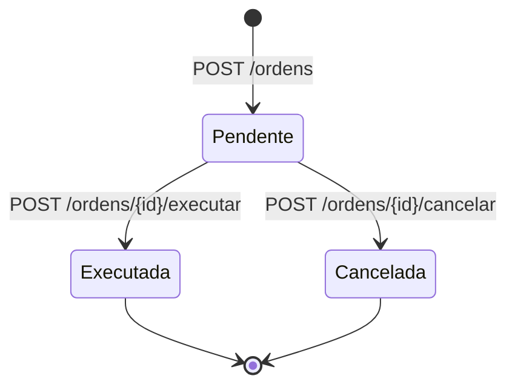
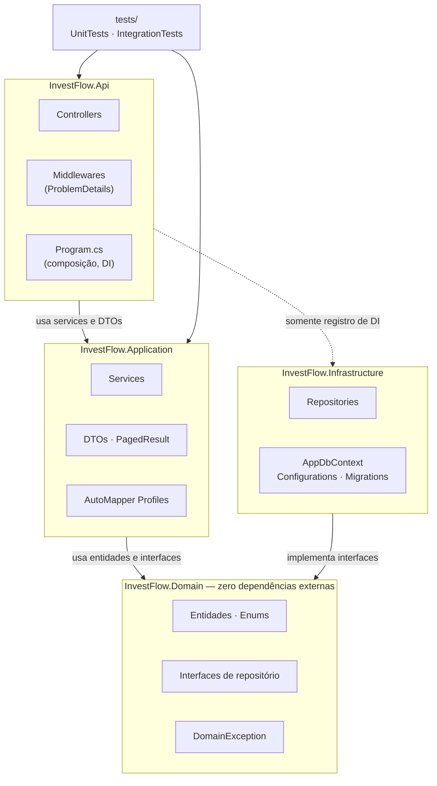

# InvestFlow — CP4 .NET (FIAP)

API REST de investimentos: cadastro de ativos e registro de ordens de compra e venda.

## Sumário

- [Domínio](#domínio)
- [Arquitetura](#arquitetura)
- [Decisões técnicas](#decisões-técnicas)
- [Como rodar](#como-rodar)
- [Testes](#testes)
- [Configuração](#configuração)
- [Endpoints](#endpoints)
- [Integrantes](#integrantes)

## Domínio

O InvestFlow modela duas entidades com relacionamento **1:N**: um **Ativo** possui várias **Ordens**.

**Ativo** — instrumento negociável.

| Campo | Regra |
|---|---|
| `Ticker` | Obrigatório, até 10 caracteres, gravado sem espaços nas pontas e em maiúsculas. Único e imutável (é a identidade de mercado). |
| `Nome` | Obrigatório, até 100 caracteres. |
| `Tipo` | `Acao`, `FII`, `RendaFixa` ou `Derivativo`. |
| `PrecoAtual` | Maior que zero, até 4 casas decimais. |
| `CriadoEm` | Preenchido na criação (UTC). |

Um ativo que já possui ordens não pode ser excluído, para preservar o histórico.

**Ordem** — compra ou venda de um ativo.

| Campo | Regra |
|---|---|
| `AtivoId` | Deve referenciar um ativo existente. |
| `Lado` | `Compra` ou `Venda`. |
| `Quantidade` | Maior que zero. |
| `PrecoExecucao` | Maior que zero, até 4 casas decimais. |
| `DataExecucao` | Informada pelo cliente; se omitida, usa o momento do registro (UTC). |
| `Status` | Toda ordem nasce `Pendente`. |
| `ValorFinanceiro` | `Quantidade × PrecoExecucao`, calculado pela entidade (não é persistido). |

Ciclo de vida da ordem:



Qualquer outra transição (executar uma ordem cancelada, cancelar uma executada, cancelar duas vezes) é
rejeitada pela própria entidade com `DomainException`, que a API devolve como **409**.

O banco é criado com um seed determinístico de **5 ativos** (um de cada tipo, mais uma segunda ação) e
**60 ordens** nos três status, volume suficiente para demonstrar a paginação.

## Arquitetura

Arquitetura em camadas, com as dependências apontando sempre para dentro, em direção ao domínio.



**Regra de dependência**

| Projeto | Pode referenciar | Não pode |
|---|---|---|
| `InvestFlow.Domain` | nenhum projeto, nenhum pacote NuGet | qualquer coisa |
| `InvestFlow.Application` | Domain | Infrastructure, Api, EF Core |
| `InvestFlow.Infrastructure` | Domain (+ Application, se precisar de contratos) | Api |
| `InvestFlow.Api` | Application; Infrastructure apenas para registrar DI | acessar `DbContext` nos controllers |

Fluxo de uma requisição: **Controller → Service → Repository → DbContext**. O controller conhece apenas
interfaces de service e DTOs; o service conhece apenas interfaces de repositório declaradas no Domain; só
a Infrastructure conhece o EF Core.

```
src/InvestFlow.Domain             -> entidades, enums, filtros, interfaces de repositório, DomainException
src/InvestFlow.Application        -> DTOs, services, AutoMapper profiles, PagedResult<T>, validação
src/InvestFlow.Infrastructure     -> AppDbContext, IEntityTypeConfiguration, repositories, migrations, seed
src/InvestFlow.Api                -> controllers, middleware de exceções, Program.cs, configuração
tests/InvestFlow.UnitTests        -> entidades, services (Moq), mapeamentos, validação, PagedResult
tests/InvestFlow.IntegrationTests -> WebApplicationFactory (HTTP completo) e repositórios sobre SQLite
```

## Decisões técnicas

| Decisão | Por quê |
|---|---|
| **Entidades ricas** (setters privados, construtor e métodos que validam) | A regra de negócio fica num único lugar. Não existe `Ordem` com quantidade zero nem transição de status inválida, venha a chamada de onde vier. |
| **Interfaces de repositório no Domain** | A Application depende de abstrações, não do EF Core. Os services são testados com Moq, sem banco. |
| **DTOs separados das entidades** (`*CreateRequest`, `*UpdateRequest`, `*Response`, `*Query`) | O contrato HTTP não vaza o modelo de persistência, e o `Ticker` pode ficar fora do `AtivoUpdateRequest` por ser imutável. |
| **AutoMapper só no sentido entidade → response** | A criação e a alteração passam pelo construtor e pelos métodos da entidade, que validam; mapear request → entidade contornaria essas regras. `NomeAtivo` e `ValorFinanceiro` são mapeados explicitamente e cobertos por `AssertConfigurationIsValid`. |
| **Validação no service, além do model binding** | `RequestValidator` executa as DataAnnotations dentro do service, então a regra vale mesmo fora do pipeline MVC (testes, outros consumidores). Os dois caminhos geram o mesmo 400. |
| **Paginação obrigatória com `PagedResult<T>`** | Nenhuma listagem devolve a tabela inteira. `PageSize` máximo de 50 limita o custo por requisição; `totalCount`, `totalPages`, `hasNext` e `hasPrevious` permitem navegar sem cálculo no cliente. |
| **Ordenação estável** (`DataExecucao DESC, Id DESC`; `Ticker, Id`) | Sem desempate, `Skip/Take` pode repetir ou pular registros entre páginas. |
| **Índices declarados explicitamente** | `IX_Ativos_Ticker` (único) garante a unicidade mesmo sob concorrência e acelera a busca por ticker. `IX_Ordens_AtivoId` atende o filtro por ativo, o JOIN e a checagem antes de excluir um ativo — o SQL Server não indexa FK sozinho. `IX_Ordens_DataExecucao_Status` serve a ordenação da listagem e o filtro por período e status. |
| **`decimal(18,4)` nos campos monetários** | Cotações e preços de execução têm até 4 casas. Os limites de `Range` nos DTOs acompanham a precisão da coluna. |
| **FK `Restrict`** | Apagar um ativo não pode apagar o histórico de ordens em cascata. O service verifica antes e responde 409 com mensagem clara. |
| **`AsNoTracking` nas leituras, `GetByIdForUpdateAsync` nas escritas** | Leitura sem custo de change tracking; a escrita trabalha sobre a entidade rastreada. |
| **Um `DbContext` derivado por provider** (`SqliteAppDbContext`, `SqlServerAppDbContext`) | Os tipos de coluna gerados diferem entre providers; cada um tem seu próprio conjunto de migrations e o provider é escolhido por configuração. |
| **SQLite como padrão** | Roda sem instalar nada: o avaliador clona, executa `dotnet run` e já tem banco com dados. |
| **Middleware global de exceções → ProblemDetails** | Controllers sem `try/catch`. `ValidationException` → 400, `NotFoundException` → 404, `DomainException` → 409, qualquer outra → 500 genérico, sem stack trace. O 400 do model binding e o 429 usam o mesmo `ApiProblemDetails`, então todo erro tem o mesmo formato e carrega `traceId`. |
| **Ativo inexistente ao criar ordem → 400, não 404** | O id vem no corpo: é dado inválido da requisição, não recurso da URL ausente. |
| **Rate limiting nativo** (`Microsoft.AspNetCore.RateLimiting`) | Sem pacote extra. Janela fixa por IP, limites configuráveis e validados na subida (`ValidateOnStart`). |
| **Brotli + Gzip com nível `Fastest`** | Listagens JSON comprimem muito; `Fastest` reduz o tamanho sem gastar CPU demais por requisição. Habilitado também para HTTPS e para `application/problem+json`. |
| **Serilog** (console + arquivo JSON compacto) | Log estruturado: cada propriedade (`Method`, `Path`, `RequestId`, `Errors`) é consultável, não só texto. `RequestId` entra no `LogContext` para correlacionar todos os logs de uma requisição. |
| **Application Insights opcional** | Sem connection string a API sobe normalmente com um `TelemetryClient` desabilitado, então o código que emite a métrica `ordens.criadas` não precisa de `if`. Nenhum segredo é versionado. |
| **Health checks em duas rotas** | `/health` verifica o banco e responde JSON detalhado; `/health/live` não executa checks e serve de liveness barato. Ambos ficam fora do rate limiting. |
| **Swagger com Annotations e XML comments** | `[SwaggerOperation]`, `[SwaggerResponse]` e `[ProducesResponseType]` documentam todos os status; os `<example>` dos DTOs preenchem os exemplos da UI. |
| **Testes de integração com `WebApplicationFactory` + SQLite em memória** | Exercitam o `Program.cs` real (middlewares, rate limiting, compressão, Swagger, migrations e seed), isolados por instância e sem dependência externa. |

## Como rodar

### Pré-requisitos

- [.NET 8 SDK](https://dotnet.microsoft.com/download/dotnet/8.0)
- Nada mais: o banco padrão é SQLite, criado automaticamente.

### Executar

```bash
git clone https://github.com/olavoneves/InvestFlow-CP4-.NET-FIAP.git
cd InvestFlow-CP4-.NET-FIAP
dotnet build
dotnet run --project src/InvestFlow.Api
```

O perfil padrão (`http`) sobe em ambiente `Development` e aplica as migrations e o seed na subida, criando
`src/InvestFlow.Api/investflow.db`.

| Recurso | URL |
|---|---|
| **Swagger UI** | http://localhost:5232/swagger |
| OpenAPI JSON | http://localhost:5232/swagger/v1/swagger.json |
| Health check detalhado | http://localhost:5232/health |
| Liveness | http://localhost:5232/health/live |

Com HTTPS: `dotnet run --project src/InvestFlow.Api --launch-profile https` → https://localhost:7026/swagger.

> As migrations só são aplicadas automaticamente em `Development`. Em outro ambiente, aplique antes com
> `dotnet ef database update --project src/InvestFlow.Infrastructure --startup-project src/InvestFlow.Api --context SqliteAppDbContext`
> (requer `dotnet tool install --global dotnet-ef`; no SQL Server use `--context SqlServerAppDbContext`).

Os logs estruturados ficam em `src/InvestFlow.Api/logs/investflow-AAAAMMDD.json` (um evento JSON por
linha, retenção de 7 dias), além do console.

## Testes

```bash
dotnet test
```

**227 testes**, todos passando:

| Projeto | Testes | O que cobre |
|---|---|---|
| `InvestFlow.UnitTests` | 99 | Regras das entidades `Ativo` e `Ordem`, services com repositórios mockados (Moq), perfis do AutoMapper, validação dos DTOs, `PagedResult` e registro de DI. |
| `InvestFlow.IntegrationTests` | 128 | Ciclo HTTP completo via `WebApplicationFactory`: CRUD, 400/404/409, formato do ProblemDetails, rate limiting (429 e rotas isentas), compressão, health checks, Swagger, métrica do Application Insights; repositórios, índices, seed e FK sobre SQLite em memória. |

Os números contam casos executados (cada `InlineData` de um `[Theory]` conta como um teste). Para rodar
apenas um projeto:

```bash
dotnet test tests/InvestFlow.UnitTests
dotnet test tests/InvestFlow.IntegrationTests
```

## Configuração

Toda chave do `appsettings.json` pode ser sobrescrita por variável de ambiente, trocando `:` por `__`.

### Banco de dados

| Chave | Padrão | Descrição |
|---|---|---|
| `Database:Provider` | `Sqlite` | `Sqlite` ou `SqlServer`. |
| `ConnectionStrings:DefaultConnection` | `Data Source=investflow.db` | Opcional no SQLite (usa o padrão); **obrigatória** no SQL Server. |

O provider é trocado só por configuração, sem alterar código — cada um tem seu `DbContext` e suas migrations
(`Persistence/Migrations/Sqlite` e `Persistence/Migrations/SqlServer`):

```powershell
# PowerShell
$env:Database__Provider = "SqlServer"
$env:ConnectionStrings__DefaultConnection = "Server=(localdb)\mssqllocaldb;Database=InvestFlow;Trusted_Connection=True;TrustServerCertificate=True"
dotnet run --project src/InvestFlow.Api
```

```bash
# Bash
Database__Provider=SqlServer \
ConnectionStrings__DefaultConnection="Server=localhost;Database=InvestFlow;User Id=sa;Password=<senha>;TrustServerCertificate=True" \
dotnet run --project src/InvestFlow.Api
```

Um valor inválido em `Database:Provider`, ou `SqlServer` sem connection string, impede a subida com mensagem
explicando o problema.

### Application Insights

**A connection string é opcional.** A telemetria só é habilitada quando ela existe. Sem ela, a API sobe
normalmente, registra no log `Application Insights desabilitado: connection string não configurada.` e a
telemetria (inclusive a métrica customizada `ordens.criadas`) é descartada.

**Nunca coloque a connection string real no `appsettings.json`** — o valor versionado é um placeholder vazio.
Configure por variável de ambiente:

```powershell
# PowerShell
$env:APPLICATIONINSIGHTS_CONNECTION_STRING = "InstrumentationKey=...;IngestionEndpoint=https://..."
dotnet run --project src/InvestFlow.Api
```

```bash
# Bash
APPLICATIONINSIGHTS_CONNECTION_STRING="InstrumentationKey=...;IngestionEndpoint=https://..." dotnet run --project src/InvestFlow.Api
```

A chave `ApplicationInsights__ConnectionString` (equivalente a `ApplicationInsights:ConnectionString`)
também é aceita e tem prioridade sobre `APPLICATIONINSIGHTS_CONNECTION_STRING`.

Quando habilitado, além da telemetria automática de requisições e dependências, cada ordem criada emite a
métrica `ordens.criadas` com a dimensão `Lado` (`Compra`/`Venda`).

### Rate limiting

Janela fixa por IP do cliente, com duas políticas:

| Política | Onde se aplica | Padrão |
|---|---|---|
| Global | Todas as rotas, exceto `/swagger/*`, `/health` e `/health/live` | 30 requisições / 10 s |
| `estrito` | Somente `GET /api/v1/ativos` (além da global) | 5 requisições / 10 s |

**Rotas isentas:** `/swagger` e tudo abaixo dele (UI, assets e `swagger.json`), `/health` e `/health/live`.

Em `GET /api/v1/ativos` as duas políticas são consumidas; basta uma se esgotar para a resposta ser 429.
Acima do limite a resposta é 429 em ProblemDetails, com o header `Retry-After`. Os health checks ficam fora
porque são sondados em alta frequência por orquestradores e monitores; as chamadas de API feitas pelo
Swagger UI continuam limitadas, pois a isenção vale apenas para os arquivos do próprio Swagger.

Ajustável pelas seções `RateLimiting:Global` e `RateLimiting:Estrito` (`PermitLimit`, `WindowSeconds`) ou
por variáveis de ambiente como `RateLimiting__Estrito__PermitLimit`. Valores menores ou iguais a zero impedem
a subida da aplicação.

## Endpoints

Base: `/api/v1`. Enums trafegam pelo nome (`"Acao"`, `"Compra"`, `"Pendente"`). Toda listagem aceita
`PageNumber` (padrão 1) e `PageSize` (padrão 10, máximo 50).

| Método | Rota | Descrição | Sucesso | Erros |
|---|---|---|---|---|
| `GET` | `/api/v1/ativos` | Lista ativos paginados. Filtros: `Tipo`, `Busca` (trecho do ticker ou nome). **Política estrita.** | 200 | 400, 429 |
| `GET` | `/api/v1/ativos/{id}` | Obtém um ativo. | 200 | 404, 429 |
| `POST` | `/api/v1/ativos` | Cadastra um ativo. Header `Location` aponta para o recurso. | 201 | 400, 429 |
| `PUT` | `/api/v1/ativos/{id}` | Atualiza nome, tipo e preço (ticker é imutável). | 200 | 400, 404, 429 |
| `DELETE` | `/api/v1/ativos/{id}` | Exclui um ativo sem ordens. | 204 | 404, 409, 429 |
| `GET` | `/api/v1/ordens` | Lista ordens paginadas, da mais recente para a mais antiga. Filtros: `AtivoId`, `Status`, `DataInicio`, `DataFim`. | 200 | 400, 429 |
| `GET` | `/api/v1/ordens/{id}` | Obtém uma ordem com nome do ativo e valor financeiro. | 200 | 404, 429 |
| `POST` | `/api/v1/ordens` | Registra uma ordem `Pendente`. | 201 | 400, 429 |
| `POST` | `/api/v1/ordens/{id}/executar` | `Pendente` → `Executada`. | 200 | 404, 409, 429 |
| `POST` | `/api/v1/ordens/{id}/cancelar` | `Pendente` → `Cancelada`. | 200 | 404, 409, 429 |
| `DELETE` | `/api/v1/ordens/{id}` | Exclui uma ordem. | 204 | 404, 429 |
| `GET` | `/health` | Status da aplicação e do banco (JSON). | 200 | 503 |
| `GET` | `/health/live` | Liveness (`Healthy`, texto). | 200 | — |

Qualquer endpoint da API pode ainda responder **500** em ProblemDetails genérico, sem detalhes internos.

| Status | Quando |
|---|---|
| 400 | DataAnnotations violadas, JSON inválido, paginação fora dos limites, ticker duplicado, `AtivoId` inexistente no corpo, `DataInicio` > `DataFim`. |
| 404 | Id da URL não existe. |
| 409 | Regra de negócio violada: excluir ativo com ordens, executar ordem não pendente, cancelar ordem executada ou já cancelada. |
| 429 | Limite de requisições excedido (header `Retry-After`). |

Os exemplos abaixo foram capturados da API rodando com o seed padrão.

### Resposta paginada — `GET /api/v1/ordens?Status=Executada&PageNumber=2&PageSize=2`

`200 OK`

```json
{
  "items": [
    {
      "id": 47,
      "ativoId": 2,
      "nomeAtivo": "Vale ON",
      "lado": "Compra",
      "quantidade": 600,
      "precoExecucao": 61.8802,
      "valorFinanceiro": 37128.1200,
      "dataExecucao": "2026-04-06T23:19:00",
      "status": "Executada"
    },
    {
      "id": 46,
      "ativoId": 1,
      "nomeAtivo": "Petrobras PN",
      "lado": "Compra",
      "quantidade": 500,
      "precoExecucao": 37.7769,
      "valorFinanceiro": 18888.4500,
      "dataExecucao": "2026-04-04T23:02:00",
      "status": "Executada"
    }
  ],
  "pageNumber": 2,
  "pageSize": 2,
  "totalCount": 45,
  "totalPages": 23,
  "hasNext": true,
  "hasPrevious": true
}
```

### `GET /api/v1/ativos?PageNumber=1&PageSize=2`

`200 OK` — ordenado por ticker.

```json
{
  "items": [
    { "id": 3, "ticker": "HGLG11", "nome": "CSHG Logística FII", "tipo": "FII", "precoAtual": 162.35, "criadoEm": "2026-01-02T10:00:00" },
    { "id": 4, "ticker": "IPCA2035", "nome": "Tesouro IPCA+ 2035", "tipo": "RendaFixa", "precoAtual": 2150.78, "criadoEm": "2026-01-02T10:00:00" }
  ],
  "pageNumber": 1,
  "pageSize": 2,
  "totalCount": 5,
  "totalPages": 3,
  "hasNext": true,
  "hasPrevious": false
}
```

### `GET /api/v1/ativos/1`

`200 OK`

```json
{
  "id": 1,
  "ticker": "PETR4",
  "nome": "Petrobras PN",
  "tipo": "Acao",
  "precoAtual": 38.12,
  "criadoEm": "2026-01-02T10:00:00"
}
```

### `POST /api/v1/ativos`

Request:

```json
{
  "ticker": " itub4 ",
  "nome": "Itaú Unibanco PN",
  "tipo": "Acao",
  "precoAtual": 33.47
}
```

`201 Created` — `Location: http://localhost:5232/api/v1/ativos/6`

```json
{
  "id": 6,
  "ticker": "ITUB4",
  "nome": "Itaú Unibanco PN",
  "tipo": "Acao",
  "precoAtual": 33.47,
  "criadoEm": "2026-09-16T23:09:51.3407929Z"
}
```

### `PUT /api/v1/ativos/6`

Request:

```json
{
  "nome": "Itaú Unibanco PN",
  "tipo": "Acao",
  "precoAtual": 34.10
}
```

`200 OK`

```json
{
  "id": 6,
  "ticker": "ITUB4",
  "nome": "Itaú Unibanco PN",
  "tipo": "Acao",
  "precoAtual": 34.1,
  "criadoEm": "2026-09-16T23:09:51.3407929"
}
```

### `POST /api/v1/ordens`

Request (`dataExecucao` é opcional):

```json
{
  "ativoId": 1,
  "lado": "Compra",
  "quantidade": 100,
  "precoExecucao": 38.15,
  "dataExecucao": "2026-09-16T14:30:00Z"
}
```

`201 Created` — `Location: http://localhost:5232/api/v1/ordens/61`

```json
{
  "id": 61,
  "ativoId": 1,
  "nomeAtivo": "Petrobras PN",
  "lado": "Compra",
  "quantidade": 100,
  "precoExecucao": 38.15,
  "valorFinanceiro": 3815.00,
  "dataExecucao": "2026-09-16T14:30:00",
  "status": "Pendente"
}
```

### `POST /api/v1/ordens/61/executar`

Sem corpo. `200 OK`

```json
{
  "id": 61,
  "ativoId": 1,
  "nomeAtivo": "Petrobras PN",
  "lado": "Compra",
  "quantidade": 100,
  "precoExecucao": 38.15,
  "valorFinanceiro": 3815.00,
  "dataExecucao": "2026-09-16T14:30:00",
  "status": "Executada"
}
```

`POST /api/v1/ordens/{id}/cancelar` responde no mesmo formato, com `"status": "Cancelada"`.
Os dois `DELETE` respondem `204 No Content`, sem corpo.

### 400 Bad Request — `POST /api/v1/ativos`

Request:

```json
{
  "ticker": "PETR4",
  "nome": "",
  "tipo": "Acao",
  "precoAtual": 0
}
```

Response (`application/problem+json`), com os erros agrupados por campo:

```json
{
  "type": "https://tools.ietf.org/html/rfc9110#section-15.5.1",
  "title": "Um ou mais erros de validação ocorreram.",
  "status": 400,
  "instance": "/api/v1/ativos",
  "errors": {
    "Nome": ["Nome é obrigatório."],
    "PrecoAtual": ["PrecoAtual deve estar entre 0,0001 e 99999999999999,9999."]
  },
  "traceId": "00-046cdc323f8554cb9ee31fc34bf3acfc-232069670856a96a-00"
}
```

Paginação fora do limite (`GET /api/v1/ativos?PageSize=100`) segue o mesmo formato:

```json
{
  "type": "https://tools.ietf.org/html/rfc9110#section-15.5.1",
  "title": "Um ou mais erros de validação ocorreram.",
  "status": 400,
  "instance": "/api/v1/ativos",
  "errors": {
    "PageSize": ["PageSize deve estar entre 1 e 50."]
  },
  "traceId": "00-fa2cb07c75e1c41db7d7e80fc0757b56-220b825fcb0a1e70-00"
}
```

### 404 Not Found — `GET /api/v1/ativos/999`

```json
{
  "type": "https://tools.ietf.org/html/rfc9110#section-15.5.5",
  "title": "Recurso não encontrado.",
  "status": 404,
  "detail": "Ativo com id 999 não foi encontrado.",
  "instance": "/api/v1/ativos/999",
  "traceId": "00-f05d16cd9f8f0f884d897fe24b203bfe-626ffdbdc93bf508-00"
}
```

### 409 Conflict — `DELETE /api/v1/ativos/1`

```json
{
  "type": "https://tools.ietf.org/html/rfc9110#section-15.5.10",
  "title": "A operação conflita com o estado atual do recurso.",
  "status": 409,
  "detail": "Não é possível excluir um ativo que possui ordens.",
  "instance": "/api/v1/ativos/1",
  "traceId": "00-e580778227f17e8f489e669824c1419c-b1ad423931f4aa77-00"
}
```

Mesmo formato ao cancelar uma ordem executada: `"detail": "Não é possível cancelar uma ordem já executada."`.

### 429 Too Many Requests — 6ª chamada a `GET /api/v1/ativos` em 10 s

Headers: `Retry-After: 10`

```json
{
  "type": "https://tools.ietf.org/html/rfc6585#section-4",
  "title": "Muitas requisições.",
  "status": 429,
  "detail": "Limite de requisições excedido para este cliente. Tente novamente em 10s.",
  "instance": "/api/v1/ativos",
  "traceId": "00-448add8d94bdf55ef13092b51a81678c-9a8a776ebabdfb2b-00"
}
```

### `GET /health`

`200 OK`

```json
{
  "status": "Healthy",
  "totalDuration": "00:00:00.0214409",
  "entries": {
    "database": {
      "data": {},
      "duration": "00:00:00.0146001",
      "status": "Healthy",
      "tags": []
    }
  }
}
```

## Integrantes

| Nome | RM |
|---|---|
| Olavo Porto Neves | RM563558 |
| Pedro Henrique Dias França | RM561940 |
| Luiz Gustavo Gonçalves | RM564495 |
| Altamir Lima | RM562906 |
| Felipe Conte | RM562248 |
