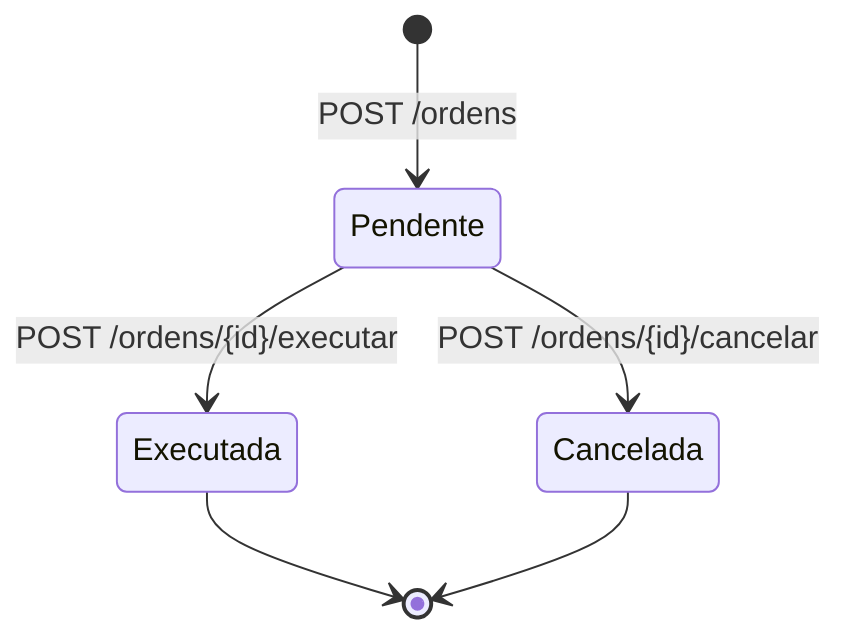
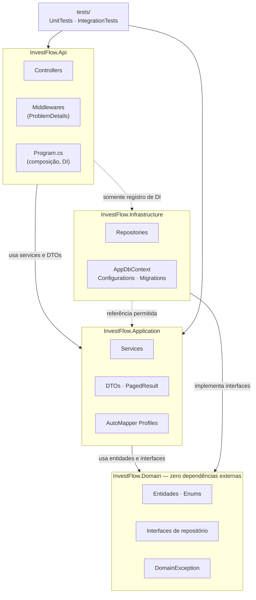

# InvestFlow — CP4 .NET (FIAP)

API REST de investimentos: cadastro de ativos e registro de ordens de compra e venda.

## Domínio

O InvestFlow modela duas entidades com relacionamento **1:N**: um **Ativo** possui várias **Ordens**.

**Ativo** — instrumento negociável.

| Campo | Regra |
|---|---|
| `Ticker` | Obrigatório, até 10 caracteres, gravado sem espaços nas pontas e em maiúsculas. Único e imutável (é a identidade de mercado). |
| `Nome` | Obrigatório, até 100 caracteres. |
| `Tipo` | `Acao`, `FII`, `RendaFixa` ou `Derivativo`. |
| `PrecoAtual` | Maior que zero, até 4 casas decimais. |
| `CriadoEm` | Preenchido na criação (UTC). |

Um ativo que já possui ordens não pode ser excluído, para preservar o histórico.

**Ordem** — compra ou venda de um ativo.

| Campo | Regra |
|---|---|
| `AtivoId` | Deve referenciar um ativo existente. |
| `Lado` | `Compra` ou `Venda`. |
| `Quantidade` | Maior que zero. |
| `PrecoExecucao` | Maior que zero, até 4 casas decimais. |
| `DataExecucao` | Informada pelo cliente; se omitida, usa o momento do registro (UTC). |
| `Status` | Toda ordem nasce `Pendente`. |
| `ValorFinanceiro` | `Quantidade × PrecoExecucao`, calculado pela entidade (não é persistido). |

Ciclo de vida da ordem:



Qualquer outra transição (executar uma ordem cancelada, cancelar uma executada, cancelar duas vezes) é
rejeitada pela própria entidade com `DomainException`, que a API devolve como **409**.

O banco é criado com um seed determinístico de **5 ativos** (um de cada tipo, mais uma segunda ação) e
**60 ordens** nos três status, volume suficiente para demonstrar a paginação.

## Arquitetura

Arquitetura em camadas, com as dependências apontando sempre para dentro, em direção ao domínio.



**Regra de dependência**

| Projeto | Pode referenciar | Não pode |
|---|---|---|
| `InvestFlow.Domain` | nenhum projeto, nenhum pacote NuGet | qualquer coisa |
| `InvestFlow.Application` | Domain | Infrastructure, Api, EF Core |
| `InvestFlow.Infrastructure` | Domain (+ Application, se precisar de contratos) | Api |
| `InvestFlow.Api` | Application; Infrastructure apenas para registrar DI | acessar `DbContext` nos controllers |

Fluxo de uma requisição: **Controller → Service → Repository → DbContext**. O controller conhece apenas
interfaces de service e DTOs; o service conhece apenas interfaces de repositório declaradas no Domain; só
a Infrastructure conhece o EF Core.

```
src/InvestFlow.Domain             -> entidades, enums, filtros, interfaces de repositório, DomainException
src/InvestFlow.Application        -> DTOs, services, AutoMapper profiles, PagedResult<T>, validação
src/InvestFlow.Infrastructure     -> AppDbContext, IEntityTypeConfiguration, repositories, migrations, seed
src/InvestFlow.Api                -> controllers, middleware de exceções, Program.cs, configuração
tests/InvestFlow.UnitTests        -> entidades, services (Moq), mapeamentos, validação, PagedResult
tests/InvestFlow.IntegrationTests -> WebApplicationFactory (HTTP completo) e repositórios sobre SQLite
```

## Configuração

### Application Insights

A telemetria só é habilitada quando existe uma connection string. Sem ela, a API sobe normalmente
e a telemetria (inclusive a métrica customizada `ordens.criadas`) é descartada.

**Nunca coloque a connection string real no `appsettings.json`** — o valor versionado é um placeholder vazio.
Configure por variável de ambiente:

```powershell
# PowerShell
$env:APPLICATIONINSIGHTS_CONNECTION_STRING = "InstrumentationKey=...;IngestionEndpoint=https://..."
dotnet run --project src/InvestFlow.Api
```

```bash
# Bash
APPLICATIONINSIGHTS_CONNECTION_STRING="InstrumentationKey=...;IngestionEndpoint=https://..." dotnet run --project src/InvestFlow.Api
```

A chave `ApplicationInsights__ConnectionString` (equivalente a `ApplicationInsights:ConnectionString`)
também é aceita e tem prioridade sobre `APPLICATIONINSIGHTS_CONNECTION_STRING`.

### Rate limiting

Janela fixa por IP do cliente, com duas políticas:

| Política | Onde se aplica | Padrão |
|---|---|---|
| Global | Todas as rotas, exceto `/swagger/*`, `/health` e `/health/live` | 30 requisições / 10 s |
| `estrito` | Somente `GET /api/v1/ativos` (além da global) | 5 requisições / 10 s |

Acima do limite a resposta é 429 em ProblemDetails, com o header `Retry-After`. Os health checks ficam fora
porque são sondados em alta frequência por orquestradores e monitores; as chamadas de API feitas pelo
Swagger UI continuam limitadas, pois a isenção vale apenas para os arquivos do próprio Swagger.

Ajustável pelas seções `RateLimiting:Global` e `RateLimiting:Estrito` (`PermitLimit`, `WindowSeconds`) ou
por variáveis de ambiente como `RateLimiting__Estrito__PermitLimit`.
